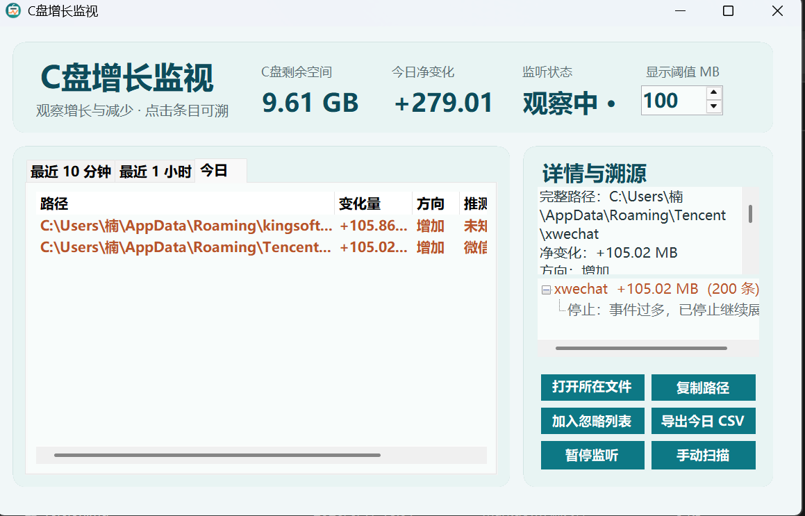

# C盘增长监视

一个面向个人 Windows 电脑的轻量 C 盘文件变化定位工具。它不做清理，不碰文件内容，只帮助你看清楚：最近哪里变大了、哪里变小了、变化了多少、可能是什么类型的变化。



## 适合谁

- C 盘空间突然变少，想快速知道是哪一片目录在增长。
- 不想使用重型磁盘分析工具，只需要一个常驻托盘的小工具。
- 想保留最近变化记录，方便自己判断是下载、缓存、日志、临时文件、聊天软件数据还是其他目录。

## 快速体验

仓库根目录带有可直接运行的体验版：

1. 下载或克隆本仓库。
2. 双击 `DiskGrowthMonitor.App.exe`。
3. 保持 `e_sqlite3.dll` 和 EXE 在同一目录，否则 SQLite 无法启动。
4. 工具启动后会显示主窗口，并常驻系统托盘。

> 当前体验版依赖本机已安装的 .NET Desktop Runtime 7/8。源码可以用 .NET 7 SDK 重新构建。

## 它会做什么

- 显示 C 盘剩余空间和今日净变化。
- 监听常见高频变化目录，例如 Downloads、Desktop、Documents、AppData、Windows Temp、ProgramData。
- 记录文件创建、修改、删除、重命名带来的大小变化。
- 按目录聚合显示，避免大量小文件刷屏。
- 同时显示增长和减少，并用不同颜色区分。
- 支持自定义显示阈值，默认 200 MB，可在主界面直接调整。
- 点击条目后展示最近具体文件事件和溯源树。
- 支持暂停监听、恢复监听、手动扫描、复制路径、打开所在文件夹、加入忽略列表、导出 CSV。

## 它不会做什么

这个工具的定位是“私人轻量定位”，不是清理软件。

- 不删除文件。
- 不移动文件。
- 不压缩文件。
- 不修改文件内容。
- 不读取文件正文内容。
- 不做注册表清理、驱动清理或系统优化。
- 不做 NTFS USN Journal、ETW 或进程级 I/O 追踪。

## 工作原理

工具使用 Windows 文件系统监听能力发现变化事件，然后延迟合并短时间内的重复事件，避免频繁写数据库。

核心流程：

1. 监听重点目录中的 Created、Changed、Deleted、Renamed。
2. 对同一路径做短时间防抖合并。
3. 读取文件元数据：路径、大小、修改时间、是否存在。
4. 与上一次快照比较，得到变化量。
5. 将事件写入本地 SQLite 数据库。
6. 按目录聚合最近 10 分钟、最近 1 小时、今日的变化。
7. 点击条目时，根据数据库里的具体事件生成溯源树。

溯源树有停止条件，避免无限展开：

- 达到最大深度。
- 事件数量过多。
- 变化量低于阈值。
- 路径属于系统敏感目录。
- 目录名已经明确指向 Temp、Cache、Downloads、Logs、CrashDumps 等类型。

## 关于“能不能看到具体文件名”

可以，但有边界：

- 如果某个文件作为独立文件写入目录，可以看到该文件名。
- 如果数据被写进压缩包、数据库、缓存容器、虚拟磁盘等单个文件内部，工具不会读取正文或解析容器格式，因此通常只能看到那个容器文件变大。

这是为了保持安全边界：只看文件元数据，不分析文件内容。

## 本地数据

运行数据默认写入：

```text
%LocalAppData%\DiskGrowthMonitor\
```

包括 SQLite 数据库、日志和导出文件。仓库已通过 `.gitignore` 永久忽略数据库、日志、导出文件和测试数据，避免误提交个人采集数据。

## 从源码构建

需要：

- Windows
- .NET SDK 7.x

命令：

```powershell
dotnet build DiskGrowthMonitor.sln
dotnet run --project tests\DiskGrowthMonitor.TestRunner\DiskGrowthMonitor.TestRunner.csproj
.\publish.ps1
```

发布脚本会生成发布目录，并把最新体验版同步到仓库根目录：

- `DiskGrowthMonitor.App.exe`
- `e_sqlite3.dll`

## 局限性

- 默认不做全盘深度扫描，优先监听高频目录。
- 监听依赖 Windows 文件系统事件，极端高频写入或权限受限路径可能被合并或跳过。
- 手动扫描会跳过系统敏感目录，避免权限和性能问题。
- 只记录元数据，不知道文件内容里具体写入了什么。
- 当前是个人轻量 V1，不提供企业级审计、进程归因或跨设备同步。

## 安全原则

项目坚持：

- 只观察。
- 只记录。
- 只展示。
- 不自动处理用户文件。

如果界面提示某个路径增长明显，后续处理仍由用户自己决定。
